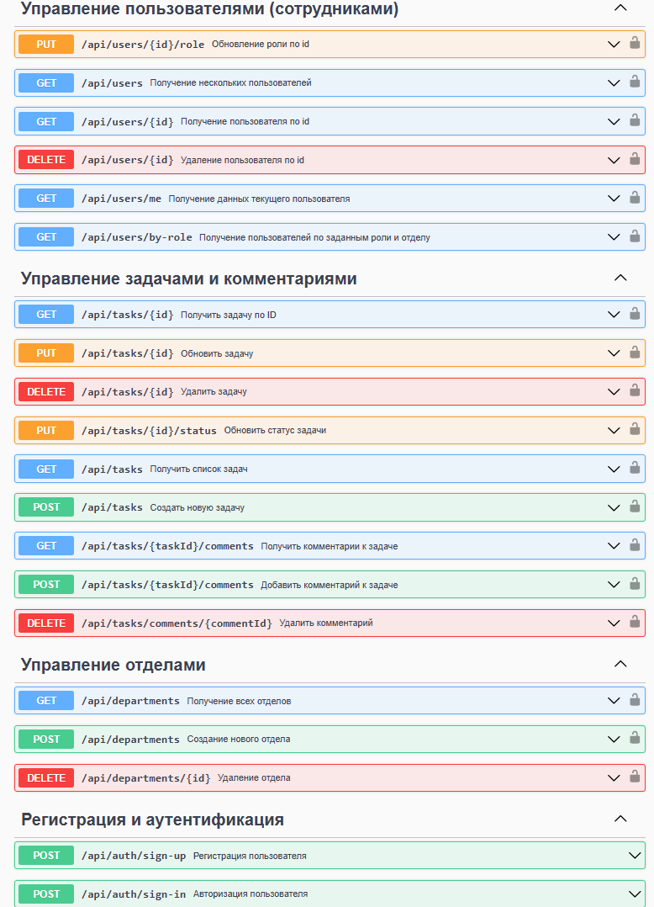

# Проект "Система управления поручениями"

Автоматизация управления задачами, поручениями и отделами в организации с контролем выполнения и разграничением прав доступа.

_Статус проекта:_

✔ Готов к тестированию (реализованы все базовые сценарии)


**Ключевые функции:**
- Управление задачами (создание, назначение, контроль сроков)
- Работа с отделами (структура компании, назначение руководителей)
- Ролевая модель (Администратор, Руководитель, Сотрудник)
- Фильтрация (по статусам, приоритетам, срокам)
- Комментарии к задачам (обсуждение выполнения)

## Стек технологий

- **Java 21**
- **Spring Boot 3.4.3**
- **Spring Security 3.4.3**
- **JWT 0.12.3**
- **PostgreSQL**
- **Hibernate**
- **MapStruct**
- **Docker, Docker Compose**
- **Lombok**
- **Swagger**

## Запуск проекта

**1. Склонировать репозиторий**
```
git clone https://github.com/Claus-Factor/Department-Task-Tracker.git
cd Department-Task-Tracker
```
**2. Запустить инфраструктуру с помощью Docker Compose**
База для сервиса отделов (сконфигурирована в файле `docker-compose.yaml`)
```
docker compose up -d
```
**3. Собрать проект**
```
mvn clean install
```
**4. Запустить сервис**

Один из способов - запустить в своей IDE.

Альтернативно - с помощью `spring-boot:run`:
```
mvn spring-boot:run
```

_Если Maven не установлен глобально, используем `mvnw`:_
```
./mvnw spring-boot:run
```

## Доступ к базе данных

- Название базы данных: `department`
- Порт: `5440`
- Логин: `root`
- Пароль: `root`

## Тестирование API
Можно использовать Swagger для тестирования API.
После запуска приложения интерактивная документация доступна по адресу:
[http://localhost:8080/swagger-ui.html](http://localhost:8080/swagger-ui.html)

**Swagger:**




## Автор

_Николай Вольхин_